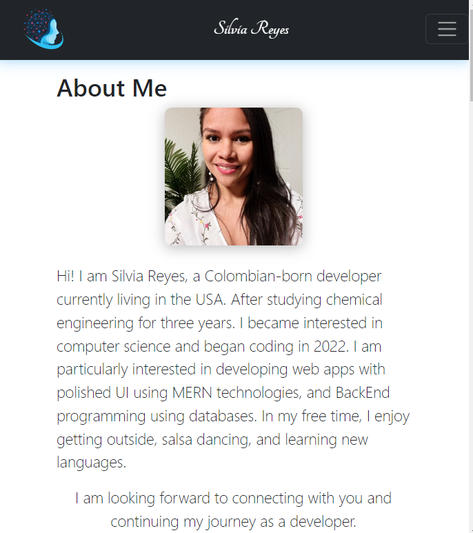
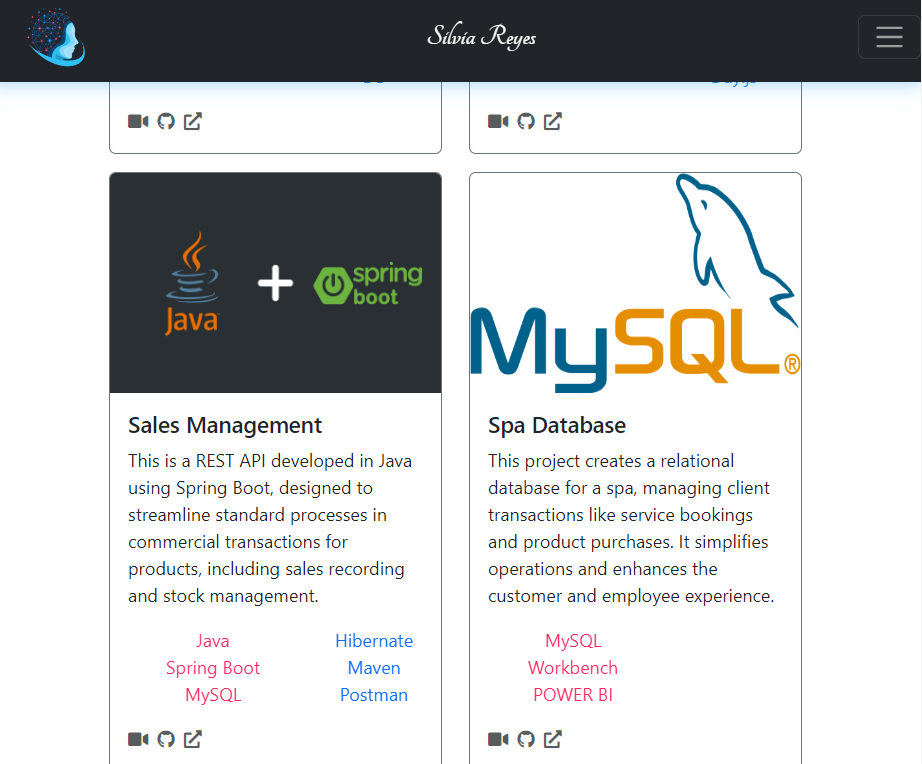
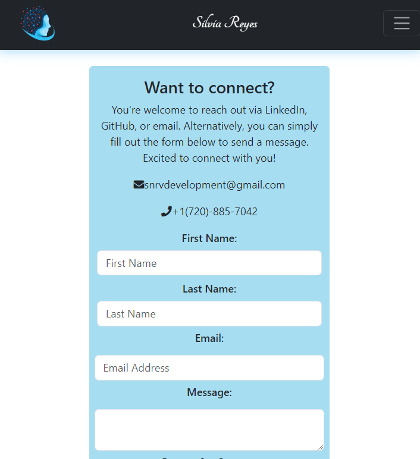

# 💼personal portfolio

Welcome to my Portfolio👩🏻‍💻, a comprehensive showcase of my work and skills. This portfolio is a single-page application built using React and Node.js, featuring a polished user interface with engaging animations. The portfolio is divided into four main sections: About Me, Portfolio, Contact, and Resumé.

Upon opening the application, you're greeted with the About Me section, providing a brief introduction and highlighting my professional journey. The Portfolio section showcases my work samples, demonstrating my experience and proficiency in building single-page applications. The Contact section offers a direct line of communication through a form, and the Resumé section includes a downloadable copy of my resumé for further details about my qualifications.

This portfolio serves as a testament to my skills and capabilities, providing potential employers with a comprehensive platform to assess my fit for their open positions.

The portfolio is built using React.js for building the user interface, along with additional libraries such as AOS, Tailwind, and SweetAlert2 to enhance the front-end interactions. React Router is used for seamless navigation within the single-page application. 

The application also includes the ability to view PDFs using the React-PDF library. The project is set up with Vite, which provides a faster and leaner development experience. 

The application is deployed on Netlify, offering a user-friendly interface that makes it easy for visitors to navigate through this project.

## Table of Contents
- [💼personal portfolio](#personal-portfolio)
  - [Table of Contents](#table-of-contents)
  - [Viewing the Portfolio](#viewing-the-portfolio)
  - [Overview](#overview)
  - 
  - 
  - [Credits](#credits)
    - [📚Acknowledgements](#acknowledgements)
  - [License](#license)
  - [Features](#features)
  - [❔Questions](#questions)

## Viewing the Portfolio

You can view the live portfolio at [MyPortfolio](https://silviareyes.netlify.app/).

## Overview

---

---

In this portfolio, you'll find:

1. **About Me:** A brief introduction and a recent photo of me with some fun facts😎.
2. **Portfolio:** Titled images of six of my applications, with links to both the deployed applications and the corresponding GitHub repositories.
3. **Contact:** A contact form with fields for a first name, last name, an email address, and a message.
4. **Resume:** A link to a downloadable resume and a list of my proficiencies.

You can navigate to these sections using the menu in the header. The title corresponding to the current section is highlighted.

## Credits

This portfolio was created using [React](https://reactjs.org/), a popular JavaScript library for building user interfaces. 

Some concepts and techniques used in this project were learned from the [University of Denver Bootcamp](https://bootcamp.du.edu/coding/).

### 📚Acknowledgements

- **React.js**: A JavaScript library for building user interfaces.
- **React Router**: Declarative routing for React.
- **React-PDF**: Display PDFs in my React application (RESUMÉ).
- **AOS**: Animate on scroll library.
- **Tailwind**: The world's most popular front-end open source toolkit.
- **SweetAlert2**: A beautiful, responsive, customizable, accessible replacement for JavaScript's popup boxes.
- **Vite**: A build tool that aims to provide a faster and leaner development experience for modern web projects.
- **ESLint**: A tool for identifying and reporting on patterns found in ECMAScript/JavaScript code.

## License

Copyright (c) Silvia Reyes. All rights reserved.

+ Licensed under the [MIT License.](https://opensource.org/licenses/MIT) : Expat License.

## Features

+ **Mobile-First Design:** The portfolio is built with a mobile-first approach, ensuring optimal user experience on mobile devices.

+ **Responsive Design:** The portfolio is designed to be responsive and can be viewed on various devices with different screen sizes.

+ **Interactive Navigation:** The portfolio includes an interactive navigation bar with titles corresponding to different sections of the portfolio. The title corresponding to the current section is highlighted.

+ **Dynamic Content:** The portfolio includes dynamic content sections such as "About Me", "Portfolio", "Contact", and "Resume".

+ **Form Validation:** The contact form includes validation for required fields and email format.

+ **Downloadable Resume:** The portfolio includes a downloadable resume for potential employers or collaborators.

+ **External Links:** The portfolio includes external links to GitHub, LinkedIn, and a third platform (Twitter).

## ❔Questions
If you have any questions, feedback, or suggestions, feel free to reach out! You can contact me through my GitHub profile or via email.

GitHub Profile 💻: [NathaliaReyes](https://github.com/NathaliaReyes)
Email 📧: snrvdevelopment@gmail.com
LinkedIn 👩🏻‍💻: [SilviaReyes](https://www.linkedin.com/in/silvia-reyes-2b907123b/)

I'm always open to discussions and eager to help. Don't hesitate to get in touch!

***Thanks for stopping!🤍***

